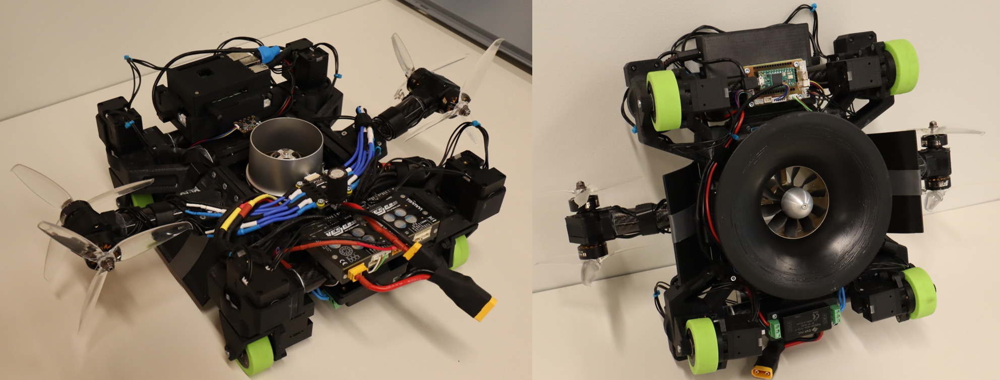

# Swerve Drive Locomotion Library
Library for Calculating kinematics of Swerve Drive Locomotion unit. This library is used in the Wall Climbing Robot (WCR), which consists of 4 independently steerable and drivable wheels, which enables the robot to have omnidirectional movement. 
The library is tested on OpenCR 1.0 Development board that runs STM32.

The library is dimension independent, and it assumes that the steering angle for wheels is from -90 to 90 deg. There is a python script for the testing library. An example of how the library is used can be seen in /example directory, where implementation is showcased on the previously mentioned WCR on the HW interface for Dynamixel motors used for wheel locomotion.

**Photo of the WCR:**:

**Video of the WCR**:
